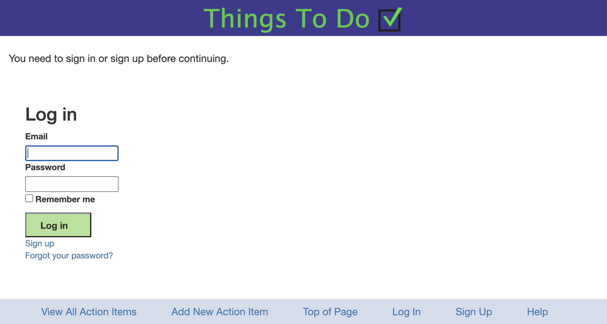
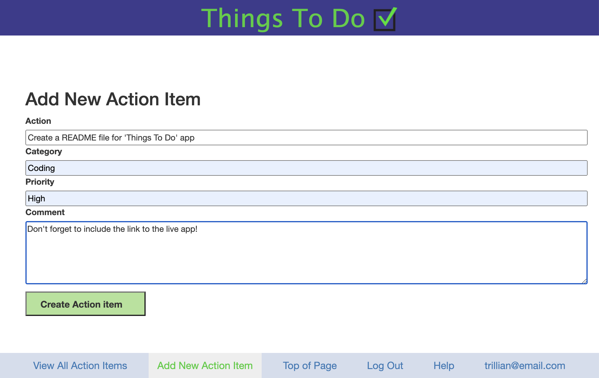
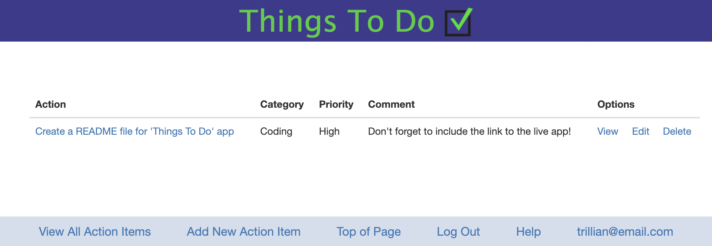

# README - Things To Do App #
'Things To Do' is an app you can use the app to track your action items. 

The app is available at: 

https://things-to-do-kr.herokuapp.com/

You will need to create an account and log in to start adding action items. 

This app was originally prepared as a terminal app for an assignment. It was then converted to a Rails app and deployed using Heroku. 

The following __Ruby gems__ have been used for the app:
* __Devise__ for user authentication

* __Pundit__ for user authorisation 

* __Bootstrap__ for styling

__Screenshots__

